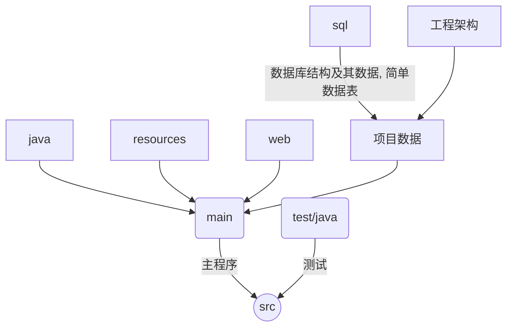
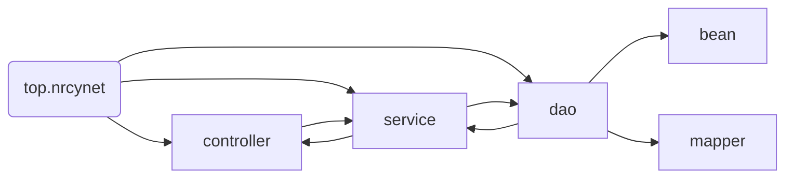

## 这是一个酒店管理系统

* 利用后端技术：**spring**，**springmvc**，**mybatia**

* 利用前段技术：**jQuery**，**bootstrap**

## 项目文件结构

```mermaid
graph TD
src((src))
main(main) --> |主程序|src
test(test/java) --> |测试|src
java --> main
resources --> main
web --> main
项目数据 --> main
sql --> |数据库结构及其数据, 简单数据表|项目数据
工程架构 --> 项目数据
```

## java包结构：

```mermaid
graph LR
top(top.nrcynet) 
top --> controller
top --> dao
top --> service
dao --> bean
dao --> mapper
dao --> service
service --> dao
service --> controller
controller --> service
```

## 项目架构2.0

